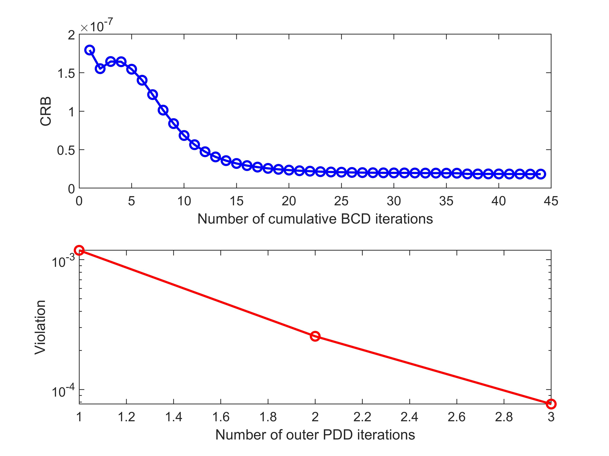
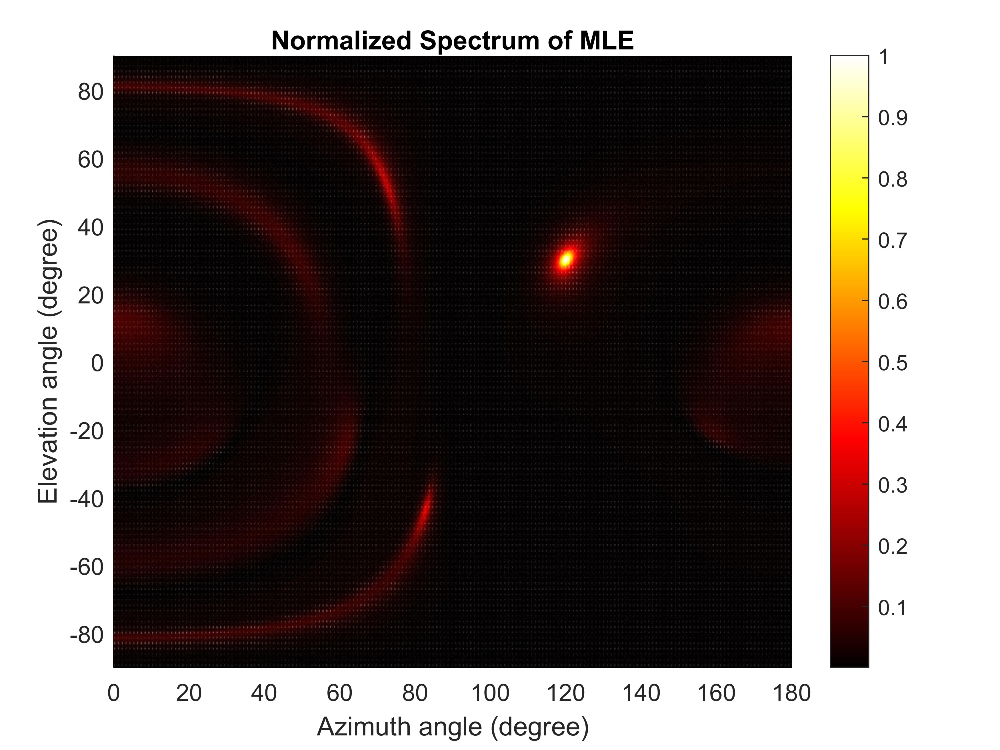

# STARS Enabled Integrated Sensing and Communications

The code for the papers 

**Z. Wang, X. Mu, and Y. Liu, “STARS Enabled Integrated Sensing and Communications,” *IEEE Trans. Wireless Commun.*, Early Access, Feb, 2023, DOI: 10.1109/TWC.2023.3245297** [[IEEE](https://ieeexplore.ieee.org/document/10050406)] [[Arxiv](https://arxiv.org/abs/2207.10748)]

**Z. Wang, X. Mu, and Y. Liu, “STARS Enabled Integrated Sensing and Communications: A CRB Optimization Perspective,” in *Proc. IEEE 96th Veh. Technol. Conf: VTC2022-Fall*, Sep. 2022, pp. 1–6.** (*Best Student Paper Awards*) [[IEEE](https://ieeexplore.ieee.org/document/10013032)]

*Note*: In this repository, we only provide the codes for the STARS with independent phase shifts. The codes can be modified to the cases of coupled phase-shift STARS based on [[1](https://github.com/zhaolin820/coupled-phase-shift-STAR-RIS)].


## Running the simulations

### Prerequisites

- [MATLAB](https://uk.mathworks.com/products/matlab.html)
- [CVX](http://cvxr.com/cvx/)

### Launch

Run `main.m`

### Expected Results

#### Convergence of the Proposed Algorithm


#### Spectrum of MLE


## Citing
If you in any way use this code for research, please cite our original articles listed above. The corresponding BiBTeX citation is given below:
```
@article{wang2022stars,
  title={{STARS} Enabled Integrated Sensing and Communications},
  author={Wang, Zhaolin and Mu, Xidong and Liu, Yuanwei},
  journal={{IEEE} Trans. Wireless Commun.},
  year={early access, Feb, 2023, doi: 10.1109/TWC.2023.3245297}
}

@inproceedings{wang2022star_vtc,
  title={{STARS} enabled integrated sensing and communications: A {CRB} optimization perspective},
  author={Wang, Zhaolin and Mu, Xidong and Liu, Yuanwei},
  booktitle={Proc. IEEE 96th Veh. Technol. Conf: VTC2022-Fall},
  month=sep,
  pages={1--6},
  year={2022}
}
```
